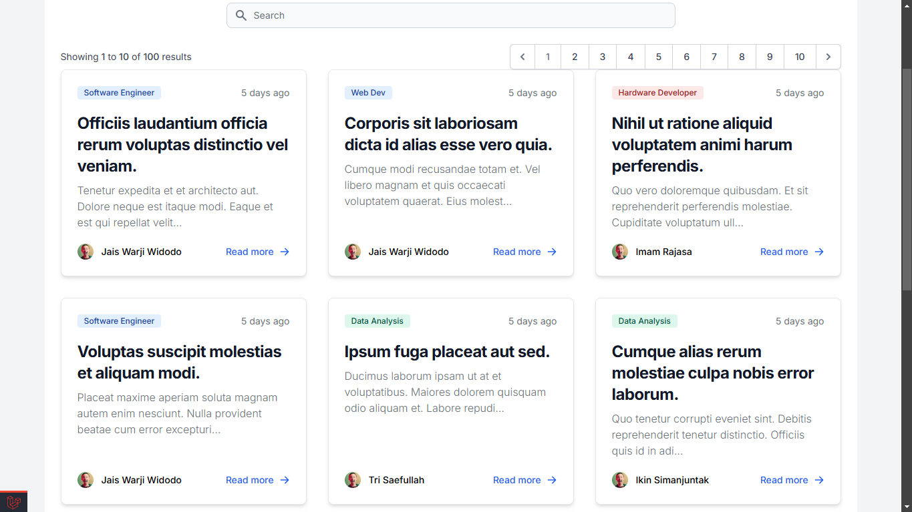

# BlogApp - Laravel Simple Blog Application

This is a simple blog application built using **Laravel**, as part of learning the basic concepts of the framework. The project is designed to practice and demonstrate fundamental features of Laravel such as routing, migrations, MVC architecture, Eloquent ORM, Blade templating, and more.

## Preview



## Features

- Basic CRUD operations for blog posts (Create, Read, Update, Delete)
- Simple user interface using **Blade** templating engine
- Database schema and migrations using **Laravel Migration**
- Data interaction via **Eloquent ORM**
- Routing management and controllers following **MVC (Model-View-Controller)** architecture
- Basic form validation and error handling

## Key Laravel Concepts Practiced

### 1. **Routing**
   - Setting up routes using `web.php` for handling different HTTP requests.
   - Route linking with controllers for handling logic and views.

### 2. **Controllers & MVC Architecture**
   - Creating controllers to manage the business logic and data flow.
   - Use of Models (BlogPost model) to interact with the database.
   - View management with Blade templates to separate presentation from logic.

### 3. **Database Migrations**
   - Using migrations to set up the blog's database schema (tables and relationships).
   - Applying migrations to automatically generate database tables.

### 4. **Eloquent ORM**
   - Interacting with the database using Eloquent models.
   - Simple query building, creating, updating, and deleting records using Eloquent's easy-to-use syntax.

### 5. **Blade Templating**
   - Creating reusable views using Blade syntax for displaying data dynamically.
   - Leveraging Blade’s template inheritance to reduce code duplication.

### 6. **Form Handling & Validation**
   - Using Laravel's form validation features to ensure correct input from users.
   - Handling errors and redirecting users back to the form with validation messages.

## Installation

1. Clone the repository:
   ```bash
   git clone https://github.com/yourusername/blogapp-laravel.git
   ```

2. Navigate to the project directory
```bash
cd blogapp-laravel
```

3. Install dependencies:
```bash
Install dependencies:
```

4. Set up the environment file:
```bash
cp .env.example .env
```

5. Generate an application key:
```bash
php artisan key:generate
```

6. Run database migrations:
```bash
php artisan migrate
```

7. Serve the application
```bash
php artisan serve
```

Visit http://localhost:8000 to view the application.

## Database Schema

The application uses a simple schema with a single `posts` table, which contains the following fields:

- `id`: Primary key
- `title`: The title of the blog post
- `content`: The body content of the blog post
- `created_at` and `updated_at`: Timestamps for when the post was created and updated.

## Learning Outcomes

Through this project, I gained a deeper understanding of:

- Laravel’s MVC structure
- Database migrations and Eloquent ORM for interacting with databases
- How to manage routes, controllers, and views effectively
- The basics of Blade templating and how to use it for dynamic content rendering

## Future Enhancements

In future iterations of this project, I plan to:

- Implement user authentication and authorization
- Add categories or tags for blog posts
- Add rich text editor for creating posts
- Improve UI with CSS frameworks like Bootstrap or TailwindCSS
